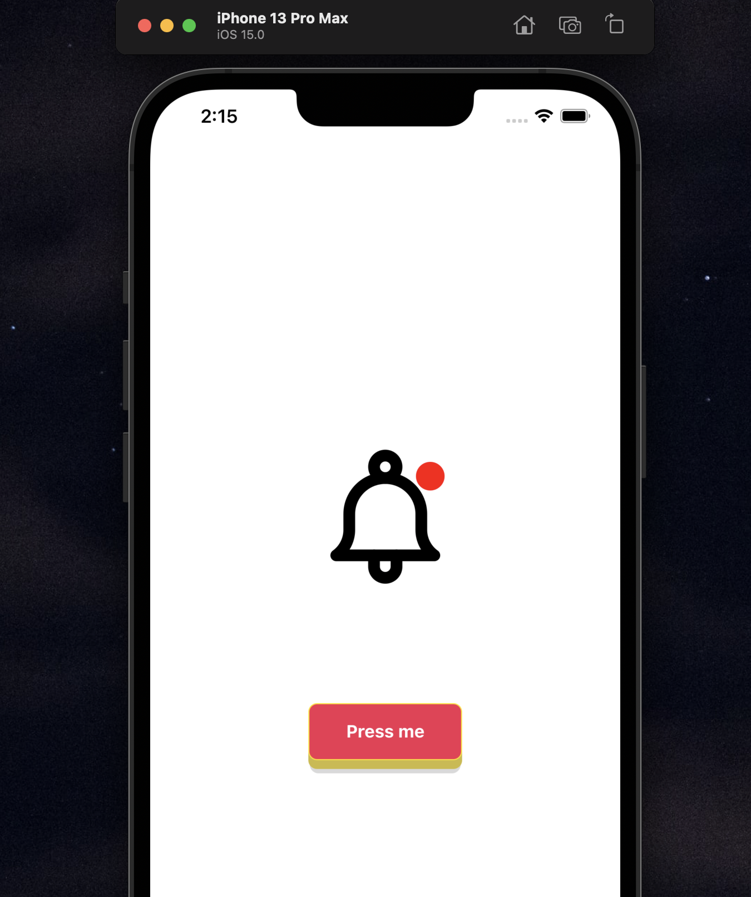

# Animated bell (Campana)



**Installation**

Clone the repo
```
git clone https://github.com/ys-sherzad/Campana.git
```
On your project directory

```
yarn install
or
npm run install
```
Install pods for iOS
```
npx pod-install
```
Run the app
```
yarn ios
or 
yarn android
```

Feel free to create an issue if you face any problems running the project.

**💬🥂 Hit me up:**
[ysherzad@dev](https://ysherzad.dev)\
[@ys.sherzad](https://www.instagram.com/ys.sherzad/)
